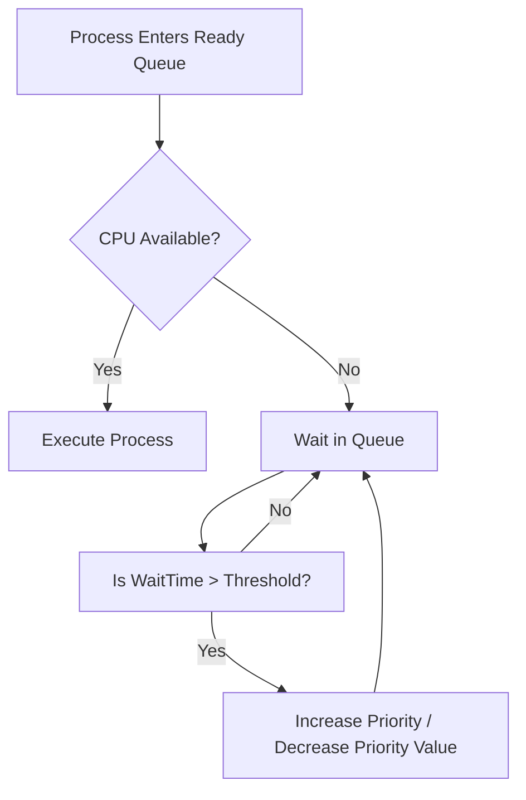

# Class Notes: Priority-Based Scheduling & Starvation Handling
**Course:** CS-301 Operating Systems Lab  
**Module 3:** CPU Scheduling Algorithms  
**Topic:** Priority Scheduling (Preemptive & Non-Preemptive), Starvation, and Aging Mechanisms  
**Date:** June 25, 2026  

---

## 1. Objective
To understand the principles of Priority-Based CPU Scheduling, evaluate its preemptive and non-preemptive variants using structured numerical problems, and analyze the starvation problem along with its standard mitigation technique: the aging mechanism.

---

## 2. Core Concepts: Priority Scheduling
In Priority Scheduling, each process is assigned a priority value (typically an integer). The CPU scheduler allocates the processor to the process with the highest priority in the ready queue.

*   **Priority Conventions:**
    *   *Low-Number Priority:* In many systems (like UNIX/Linux), lower numbers represent higher priorities (e.g., $0$ is the highest priority, $99$ is lower).
    *   *High-Number Priority:* In other systems (like Windows), larger integers represent higher priorities.
    *   *For this note, we will assume: Lower integer value = Higher priority.*
*   **Static vs. Dynamic Priorities:**
    *   **Static Priorities:** Assigned at creation time and do not change during the process's lifetime (e.g., based on process type, user billing class).
    *   **Dynamic Priorities:** Adjusted by the OS kernel during runtime based on resource consumption, waiting time, or I/O behavior (e.g., favoring I/O-bound jobs to maximize device utilization).

---

## 3. Preemptive vs. Non-Preemptive Priority Scheduling
Like other scheduling algorithms, priority scheduling operates in two modes:

1.  **Non-Preemptive Priority Scheduling:**
    *   Once a process is allocated the CPU, it holds it until it either terminates or yields (e.g., blocks for I/O).
    *   If a higher-priority process arrives, it is placed at the front of the ready queue but does not interrupt the currently running process.
2.  **Preemptive Priority Scheduling:**
    *   If a newly arrived process has a higher priority than the currently executing process, the running process is immediately preempted and returned to the ready queue.
    *   The CPU is then allocated to the newly arrived higher-priority process.

---

## 4. Practice Problem: Numerical Analysis
**Problem Statement:** Five processes arrive at the times indicated, each with a specific burst time and priority. Compute the completion time ($CT$), turnaround time ($TAT$), and waiting time ($WT$) for both **Non-Preemptive** and **Preemptive** Priority Scheduling.

*   *Priority Scale:* Lower number = Higher priority.
*   *Process Details:*
    *   $P_1$: $AT = 0\text{ ms}$, $BT = 4\text{ ms}$, $Priority = 3$
    *   $P_2$: $AT = 1\text{ ms}$, $BT = 3\text{ ms}$, $Priority = 1$
    *   $P_3$: $AT = 2\text{ ms}$, $BT = 1\text{ ms}$, $Priority = 4$
    *   $P_4$: $AT = 3\text{ ms}$, $BT = 5\text{ ms}$, $Priority = 2$
    *   $P_5$: $AT = 4\text{ ms}$, $BT = 2\text{ ms}$, $Priority = 5$

---

### A. Non-Preemptive Priority Scheduling Solution
*   **Time 0:** Only $P_1$ has arrived. $P_1$ starts executing and runs to completion because it is non-preemptive ($t = 0 \rightarrow 4$).
*   **Time 4:** $P_2, P_3, P_4, P_5$ have all arrived. We sort them by priority:
    1.  $P_2$ (Priority 1)
    2.  $P_4$ (Priority 2)
    3.  $P_3$ (Priority 4)
    4.  $P_5$ (Priority 5)
    *   $P_2$ runs next ($t = 4 \rightarrow 7$).
*   **Time 7:** $P_4$ runs next ($t = 7 \rightarrow 12$).
*   **Time 12:** $P_3$ runs next ($t = 12 \rightarrow 13$).
*   **Time 13:** $P_5$ runs last ($t = 13 \rightarrow 15$).

#### Gantt Chart (Non-Preemptive):
```
+-------+-------+---------------+---+-------+
|  P1   |  P2   |      P4       |P3 |  P5   |
+-------+-------+---------------+---+-------+
0       4       7              12  13      15
```

#### Calculation Table:
| Process | Arrival Time ($AT$) | Burst Time ($BT$) | Priority | Completion Time ($CT$) | Turnaround Time ($TAT$) | Waiting Time ($WT$) |
| :---: | :---: | :---: | :---: | :---: | :---: | :---: |
| **$P_1$** | 0 | 4 | 3 | 4 | 4 | 0 |
| **$P_2$** | 1 | 3 | 1 | 7 | 6 | 3 |
| **$P_4$** | 3 | 5 | 2 | 12 | 9 | 4 |
| **$P_3$** | 2 | 1 | 4 | 13 | 11 | 10 |
| **$P_5$** | 4 | 2 | 5 | 15 | 11 | 9 |
| **Total** | - | 15 | - | - | **41** | **26** |

*   **Average Turnaround Time:** $\frac{41}{5} = 8.2\text{ ms}$
*   **Average Waiting Time:** $\frac{26}{5} = 5.2\text{ ms}$

---

### B. Preemptive Priority Scheduling Solution
*   **Time 0:** Only $P_1$ (Priority 3) is active. $P_1$ runs.
*   **Time 1:** $P_2$ (Priority 1) arrives. Since $Priority(P_2) < Priority(P_1)$ ($1 < 3$), $P_1$ is preempted. $P_1$ has $3\text{ ms}$ remaining. $P_2$ begins running.
*   **Time 2:** $P_3$ (Priority 4) arrives. $P_2$ (Priority 1) remains the highest priority and continues running.
*   **Time 3:** $P_4$ (Priority 2) arrives. $P_2$ (Priority 1) remains the highest priority and continues running.
*   **Time 4:** $P_2$ completes. Ready queue contains: $P_1$ (rem=3, Pri=3), $P_3$ (rem=1, Pri=4), $P_4$ (rem=5, Pri=2), $P_5$ (rem=2, Pri=5).  
    $P_4$ (Priority 2) is selected. $P_4$ runs ($t = 4 \rightarrow 9$).
*   **Time 9:** $P_4$ completes. Ready queue contains: $P_1$ (rem=3, Pri=3), $P_3$ (rem=1, Pri=4), $P_5$ (rem=2, Pri=5).  
    $P_1$ (Priority 3) is selected. $P_1$ runs ($t = 9 \rightarrow 12$).
*   **Time 12:** $P_1$ completes. Ready queue contains: $P_3$ (rem=1, Pri=4), $P_5$ (rem=2, Pri=5).  
    $P_3$ (Priority 4) is selected. $P_3$ runs ($t = 12 \rightarrow 13$).
*   **Time 13:** $P_3$ completes. $P_5$ runs last ($t = 13 \rightarrow 15$).

#### Gantt Chart (Preemptive):
```
+-+-------+---------------+-------+-+-------+
|P|  P2   |      P4       |  P1   |P|  P5   |
|1|       |               |       |3|       |
+-+-------+---------------+-------+-+-------+
0 1       4               9      12 13     15
```

#### Calculation Table:
| Process | Arrival Time ($AT$) | Burst Time ($BT$) | Priority | Completion Time ($CT$) | Turnaround Time ($TAT$) | Waiting Time ($WT$) |
| :---: | :---: | :---: | :---: | :---: | :---: | :---: |
| **$P_1$** | 0 | 4 | 3 | 12 | 12 | 8 |
| **$P_2$** | 1 | 3 | 1 | 4 | 3 | 0 |
| **$P_4$** | 3 | 5 | 2 | 9 | 6 | 1 |
| **$P_3$** | 2 | 1 | 4 | 13 | 11 | 10 |
| **$P_5$** | 4 | 2 | 5 | 15 | 11 | 9 |
| **Total** | - | 15 | - | - | **43** | **28** |

*   **Average Turnaround Time:** $\frac{43}{5} = 8.6\text{ ms}$
*   **Average Waiting Time:** $\frac{28}{5} = 5.6\text{ ms}$

---

## 5. The Starvation Problem
One major drawback of priority scheduling is **Starvation (Indefinite Blocking)**.
*   **Mechanics:** If a system has a constant stream of high-priority processes arriving, a low-priority process currently waiting in the ready queue may never receive the CPU.
*   **Consequence:** The low-priority process sits indefinitely in the ready state, starving for CPU cycles. In severe cases, the process may time out or exhaust kernel resources waiting for execution.
*   **Real-world Anecdote:** When the MIT compatible time-sharing system (CTSS) was shut down in 1973, administrators found a low-priority process that had been submitted in 1967 and had never run.

---

## 6. The Aging Mechanism (Starvation Mitigation)
**Aging** is a technique that solves the starvation problem by gradually increasing the priority of processes that wait in the system for a long time.

### Mathematical & Logical Mechanics:
Suppose priority is represented as an integer, where lower values mean higher priority:
$$\text{Priority}_{\text{new}} = \text{Priority}_{\text{initial}} - \lfloor \frac{\text{WaitTime}}{k} \rfloor$$
where:
*   $\text{Priority}_{\text{initial}}$ is the priority assigned at arrival.
*   $\text{WaitTime}$ is the duration the process has spent in the ready queue without CPU execution.
*   $k$ is a system tuning parameter (e.g., every $10\text{ ms}$ of waiting reduces the priority value by $1$, effectively increasing its priority rank).

### Visualizing the Aging Process:


---

## 7. C Code Demonstration: Priority Scheduler Simulation with Aging
The following program implements a priority scheduler that simulates aging to prevent starvation.

```c
#include <stdio.h>
#include <stdbool.h>

#define MAX_PROCESSES 4
#define AGING_THRESHOLD 5  // Every 5 cycles of waiting, priority improves by 1

typedef struct {
    int pid;
    int burst_time;
    int priority;       // Lower = Higher Priority
    int wait_time;
} Process;

void print_queue(Process proc[], int n) {
    printf("\n--- Current Ready Queue ---\n");
    for (int i = 0; i < n; i++) {
        if (proc[i].burst_time > 0) {
            printf("Process P%d | Remaining BT: %d | Priority: %d | Wait Time: %d\n",
                   proc[i].pid, proc[i].burst_time, proc[i].priority, proc[i].wait_time);
        }
    }
}

int main() {
    Process proc[MAX_PROCESSES] = {
        {1, 8, 5, 0}, // P1: BT=8, Pri=5 (Low Priority)
        {2, 3, 2, 0}, // P2: BT=3, Pri=2 (Medium-High)
        {3, 4, 1, 0}, // P3: BT=4, Pri=1 (Highest Priority)
        {4, 2, 6, 0}  // P4: BT=2, Pri=6 (Lowest Priority)
    };

    int time = 0;
    int completed = 0;

    printf("Starting Priority Scheduler Simulation (With Aging)\n");

    while (completed < MAX_PROCESSES) {
        // Find highest priority process that is not yet finished
        int highest_pri_idx = -1;
        int min_pri_val = 9999;

        for (int i = 0; i < MAX_PROCESSES; i++) {
            if (proc[i].burst_time > 0) {
                if (proc[i].priority < min_pri_val) {
                    min_pri_val = proc[i].priority;
                    highest_pri_idx = i;
                }
            }
        }

        if (highest_pri_idx != -1) {
            // Execute chosen process for 1 time unit (Preemptive simulation step)
            proc[highest_pri_idx].burst_time--;
            time++;
            printf("[Time %d] P%d executes (Remaining BT: %d)\n", time, proc[highest_pri_idx].pid, proc[highest_pri_idx].burst_time);

            if (proc[highest_pri_idx].burst_time == 0) {
                completed++;
                printf("Process P%d has finished execution.\n", proc[highest_pri_idx].pid);
            }

            // Age all other waiting processes
            for (int i = 0; i < MAX_PROCESSES; i++) {
                if (proc[i].burst_time > 0 && i != highest_pri_idx) {
                    proc[i].wait_time++;
                    
                    // Aging check: if wait time exceeds threshold, increase priority
                    if (proc[i].wait_time % AGING_THRESHOLD == 0 && proc[i].priority > 1) {
                        proc[i].priority--; // Value decreases, priority increases
                        printf(">> [AGING] P%d priority boosted to %d due to waiting!\n", proc[i].pid, proc[i].priority);
                    }
                }
            }
        }
    }
    printf("\nAll processes executed successfully. Simulation complete.\n");
    return 0;
}
```
