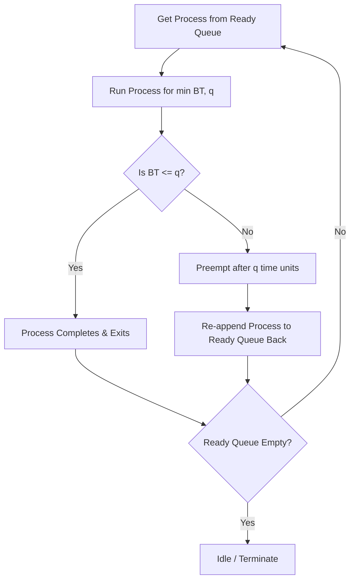

# Class Notes: Time-Sliced Execution Systems (Round Robin Analysis)
**Course:** CS-301 Operating Systems Lab  
**Module 3:** CPU Scheduling Algorithms  
**Topic:** Round Robin Scheduling, Time Quantum Optimization, and Context Switching  
**Date:** June 25, 2026  

---

## 1. Objective
To understand time-sliced CPU execution, analyze how the choice of time quantum affects system performance and responsiveness, compute scheduling metrics (CT, TAT, WT) through a numerical problem, and discuss context-switch overheads.

---

## 2. Core Concepts: Round Robin (RR) Scheduling
Round Robin scheduling is designed specifically for time-sharing systems. 
*   **Time Quantum (Slice):** The CPU scheduler defines a small unit of time, called a **time quantum** ($q$), usually ranging from $10$ to $100$ milliseconds.
*   **Queue Mechanics:** The ready queue is treated as a circular First-In-First-Out (FIFO) queue.
*   **Execution Flow:**
    1. The scheduler selects the process at the head of the ready queue.
    2. It sets a timer to interrupt after 1 time quantum.
    3. The process executes.
    4. **Interrupt:** If the process's CPU burst is shorter than $q$, the process yields the CPU voluntarily. If it is longer than $q$, the timer interrupts, the OS preempts the process, and appends it to the back of the ready queue.
    5. The scheduler then selects the next process in the queue.

---

## 3. The Impact of Time Quantum ($q$)
The performance of the Round Robin algorithm depends heavily on the size of the time quantum:

*   **Case 1: $q \rightarrow \infty$ (Very Large Quantum):**
    *   If $q$ is larger than the longest burst time of any active process, Round Robin degenerates into **First-Come, First-Served (FCFS)** scheduling.
*   **Case 2: $q \rightarrow 0$ (Very Small Quantum):**
    *   If $q$ is extremely small (e.g., $1\mu\text{s}$), it creates the illusion of **Processor Sharing** (where $N$ processes run simultaneously, each at $\frac{1}{N}$-th of the CPU speed).
    *   *Drawback:* High context-switching overhead. The CPU will spend more time saving and loading registers than executing user code, leading to major system throughput collapse.
*   **Rule of Thumb:** The time quantum should be large relative to the context-switch time. Typically, $80\%$ of the CPU bursts should be shorter than the time quantum.

---

## 4. Practice Problem: Numerical Analysis
**Problem Statement:** Four processes arrive at $t = 0$ with the following burst times. Solve using Round Robin scheduling with a Time Quantum ($q$) of $3\text{ ms}$. Compute $CT$, $TAT$, and $WT$.
*   $P_1$: $BT = 8\text{ ms}$
*   $P_2$: $BT = 4\text{ ms}$
*   $P_3$: $BT = 3\text{ ms}$
*   $P_4$: $BT = 5\text{ ms}$

---

### A. Execution Sequence and Ready Queue States
*   **Queue Init (t=0):** $[P_1, P_2, P_3, P_4]$
*   **$t = 0 \rightarrow 3$:** $P_1$ executes (Remaining $BT = 5$). Queue changes: $[P_2, P_3, P_4, P_1]$.
*   **$t = 3 \rightarrow 6$:** $P_2$ executes (Remaining $BT = 1$). Queue changes: $[P_3, P_4, P_1, P_2]$.
*   **$t = 6 \rightarrow 9$:** $P_3$ executes (Terminates). Queue changes: $[P_4, P_1, P_2]$.
*   **$t = 9 \rightarrow 12$:** $P_4$ executes (Remaining $BT = 2$). Queue changes: $[P_1, P_2, P_4]$.
*   **$t = 12 \rightarrow 15$:** $P_1$ executes (Remaining $BT = 2$). Queue changes: $[P_2, P_4, P_1]$.
*   **$t = 15 \rightarrow 16$:** $P_2$ executes (Terminates). Queue changes: $[P_4, P_1]$.
*   **$t = 16 \rightarrow 18$:** $P_4$ executes (Terminates). Queue changes: $[P_1]$.
*   **$t = 18 \rightarrow 20$:** $P_1$ executes (Terminates).

---

### B. Gantt Chart
```
+---+---+---+---+---+--+--+--+
|P1 |P2 |P3 |P4 |P1 |P2|P4|P1|
+---+---+---+---+---+--+--+--+
0   3   6   9   12  15 16 18 20
```

---

### C. Calculation Table:
| Process | Arrival Time ($AT$) | Burst Time ($BT$) | Completion Time ($CT$) | Turnaround Time ($TAT$) | Waiting Time ($WT$) |
| :---: | :---: | :---: | :---: | :---: | :---: |
| **$P_1$** | 0 | 8 | 20 | 20 | 12 |
| **$P_2$** | 0 | 4 | 16 | 16 | 12 |
| **$P_3$** | 0 | 3 | 9  | 9  | 6  |
| **$P_4$** | 0 | 5 | 18 | 18 | 13 |
| **Total** | - | 20 | -  | **63** | **43** |

*   **Average Turnaround Time:** $\frac{63}{4} = 15.75\text{ ms}$
*   **Average Waiting Time:** $\frac{43}{4} = 10.75\text{ ms}$

---

## 5. Round Robin Flowchart


---

## 6. Python Code: Round Robin Simulation
```python
def round_robin_simulation(processes, quantum):
    time = 0
    queue = list(processes.keys())
    remaining_burst = {p: processes[p] for p in processes}
    wt = {p: 0 for p in processes}
    ct = {p: 0 for p in processes}
    tat = {p: 0 for p in processes}
    
    print(f"Time Quantum: {quantum}ms\nSimulation Timeline:")
    
    while queue:
        p = queue.pop(0)
        exec_time = min(remaining_burst[p], quantum)
        print(f"[Time {time} -> {time + exec_time}] {p} runs")
        
        # Age waiting processes
        for other_p in queue:
            wt[other_p] += exec_time
            
        time += exec_time
        remaining_burst[p] -= exec_time
        
        if remaining_burst[p] > 0:
            queue.append(p)
        else:
            ct[p] = time
            tat[p] = ct[p]
            wt[p] = tat[p] - processes[p]
            print(f"** {p} Finished at {time}ms | TAT: {tat[p]} | WT: {wt[p]}")

    print("\nSummary Results:")
    print("Process\tBT\tCT\tTAT\tWT")
    for p in processes:
        print(f"{p}\t{processes[p]}\t{ct[p]}\t{tat[p]}\t{wt[p]}")

if __name__ == "__main__":
    job_list = {"P1": 8, "P2": 4, "P3": 3, "P4": 5}
    round_robin_simulation(job_list, 3)
```
