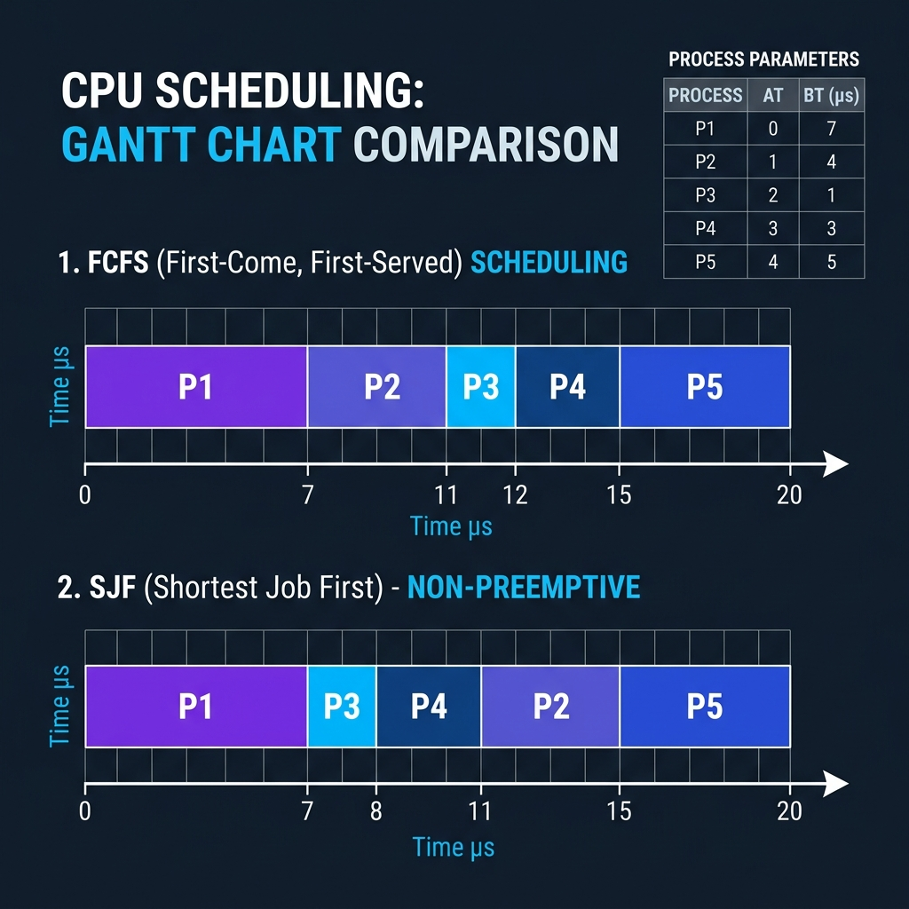

# Class Notes: CPU Scheduling Problems - FCFS vs. SJF & Convoy Effect
**Course:** CS-301 Operating Systems Lab  
**Module 3:** CPU Scheduling Algorithms  
**Topic:** FCFS & SJF Problem Solving, Gantt Charts, and Convoy Effect Analysis  
**Date:** June 11, 2026  

---

## 1. Objective
To solve non-preemptive scheduling problems using First-Come First-Served (FCFS) and Shortest Job First (SJF) scheduling algorithms, calculate average waiting times (WT) and turnaround times (TAT), and explain the mechanics of the Convoy Effect.

---

## 2. Problem Q1: Concurrency at Time 0
**Question:** Five processes arrive at time 0 with burst times: $P_1=7, P_2=4, P_3=1, P_4=4, P_5=2$. Compute average Waiting Time and Turnaround Time using FCFS and non-preemptive SJF. Draw Gantt charts.

### A. FCFS Scheduling
Since all processes arrive at time 0, they are executed in order of their PID ($P_1, P_2, P_3, P_4, P_5$).

#### Gantt Chart (FCFS):
```
+-------+-------+---+-------+---+
|  P1   |  P2   |P3 |  P4   |P5 |
+-------+-------+---+-------+---+
0       7      11  12      16  18
```

#### Calculation Table:
*   $TAT = Completion\ Time - Arrival\ Time$ (Since $AT = 0$, $TAT = CT$)
*   $WT = Turnaround\ Time - Burst\ Time$

| Process | Arrival Time ($AT$) | Burst Time ($BT$) | Completion Time ($CT$) | Turnaround Time ($TAT$) | Waiting Time ($WT$) |
| :---: | :---: | :---: | :---: | :---: | :---: |
| **$P_1$** | 0 | 7 | 7 | 7 | 0 |
| **$P_2$** | 0 | 4 | 11 | 11 | 7 |
| **$P_3$** | 0 | 1 | 12 | 12 | 11 |
| **$P_4$** | 0 | 4 | 16 | 16 | 12 |
| **$P_5$** | 0 | 2 | 18 | 18 | 16 |
| **Total** | - | 18 | - | **64** | **46** |

*   **Average Turnaround Time:** $\frac{64}{5} = 12.8\text{ ms}$
*   **Average Waiting Time:** $\frac{46}{5} = 9.2\text{ ms}$

---

### B. Non-Preemptive SJF Scheduling
Since all processes arrive at time 0, they are sorted by burst time. Tie-breakers for equal burst times ($P_2=4, P_4=4$) are resolved by lowest PID ($P_2$ first).  
**Execution Order:** $P_3\ (1) \rightarrow P_5\ (2) \rightarrow P_2\ (4) \rightarrow P_4\ (4) \rightarrow P_1\ (7)$

#### Gantt Chart (SJF):
```
+-+---+-------+-------+-------+
|P|P5 |  P2   |  P4   |  P1   |
|3|   |       |       |       |
+-+---+-------+-------+-------+
0 1   3       7      11      18
```

#### Calculation Table:
| Process | Arrival Time ($AT$) | Burst Time ($BT$) | Completion Time ($CT$) | Turnaround Time ($TAT$) | Waiting Time ($WT$) |
| :---: | :---: | :---: | :---: | :---: | :---: |
| **$P_3$** | 0 | 1 | 1 | 1 | 0 |
| **$P_5$** | 0 | 2 | 3 | 3 | 1 |
| **$P_2$** | 0 | 4 | 7 | 7 | 3 |
| **$P_4$** | 0 | 4 | 11 | 11 | 7 |
| **$P_1$** | 0 | 7 | 18 | 18 | 11 |
| **Total** | - | 18 | - | **40** | **22** |

*   **Average Turnaround Time:** $\frac{40}{5} = 8.0\text{ ms}$
*   **Average Waiting Time:** $\frac{22}{5} = 4.4\text{ ms}$

---

## 3. Problem Q2: Non-Zero Arrival Times
**Question:** A process set has AT/BT values: $P_1(0,8), P_2(1,4), P_3(2,9), P_4(3,5)$. Compute WT and TAT using FCFS and SJF (Both Non-Preemptive and Preemptive). Which algorithm gives lower average waiting time and why?

### A. FCFS Scheduling (Order of Arrival: $P_1 \rightarrow P_2 \rightarrow P_3 \rightarrow P_4$)

#### Gantt Chart:
```
+---------------+-------+-------------------+----------+
|      P1       |  P2   |        P3         |    P4    |
+---------------+-------+-------------------+----------+
0               8      12                  21         26
```

#### Calculation Table:
| Process | Arrival Time ($AT$) | Burst Time ($BT$) | Completion Time ($CT$) | Turnaround Time ($TAT$) | Waiting Time ($WT$) |
| :---: | :---: | :---: | :---: | :---: | :---: |
| **$P_1$** | 0 | 8 | 8 | 8 | 0 |
| **$P_2$** | 1 | 4 | 12 | 11 | 7 |
| **$P_3$** | 2 | 9 | 21 | 19 | 10 |
| **$P_4$** | 3 | 5 | 26 | 23 | 18 |
| **Total** | - | 26 | - | **61** | **35** |

*   **Average Turnaround Time:** $\frac{61}{4} = 15.25\text{ ms}$
*   **Average Waiting Time:** $\frac{35}{4} = 8.75\text{ ms}$

---

### B. Non-Preemptive SJF Scheduling
*   **Time 0:** Only $P_1$ is in queue. $P_1$ runs to completion ($t = 8$).
*   **Time 8:** $P_2, P_3, P_4$ have arrived. Sorted by burst time: $P_2\ (4) < P_4\ (5) < P_3\ (9)$.  
    $P_2$ runs next ($t = 8 \rightarrow 12$).
*   **Time 12:** $P_4$ runs next ($t = 12 \rightarrow 17$).
*   **Time 17:** $P_3$ runs last ($t = 17 \rightarrow 26$).

#### Gantt Chart:
```
+---------------+-------+----------+-------------------+
|      P1       |  P2   |    P4    |        P3         |
+---------------+-------+----------+-------------------+
0               8      12         17                  26
```

#### Calculation Table:
| Process | Arrival Time ($AT$) | Burst Time ($BT$) | Completion Time ($CT$) | Turnaround Time ($TAT$) | Waiting Time ($WT$) |
| :---: | :---: | :---: | :---: | :---: | :---: |
| **$P_1$** | 0 | 8 | 8 | 8 | 0 |
| **$P_2$** | 1 | 4 | 12 | 11 | 7 |
| **$P_4$** | 3 | 5 | 17 | 14 | 9 |
| **$P_3$** | 2 | 9 | 26 | 24 | 15 |
| **Total** | - | 26 | - | **57** | **31** |

*   **Average Turnaround Time:** $\frac{57}{4} = 14.25\text{ ms}$
*   **Average Waiting Time:** $\frac{31}{4} = 7.75\text{ ms}$

---

### C. Preemptive SJF / SRTF (Shortest Remaining Time First)
*   **Time 0:** $P_1$ starts running (Remaining $P_1 = 8$).
*   **Time 1:** $P_2$ (BT=4) arrives. Remaining $P_1 = 7$. Since $BT(P_2) < Rem(P_1)$, $P_1$ is preempted. $P_2$ runs.
*   **Time 2:** $P_3$ (BT=9) arrives. Remaining $P_2 = 3$. $P_2$ continues.
*   **Time 3:** $P_4$ (BT=5) arrives. Remaining $P_2 = 2$. $P_2$ continues.
*   **Time 5:** $P_2$ finishes. Queue has: $P_1$ (rem=7), $P_4$ (rem=5), $P_3$ (rem=9). Shortest is $P_4$. $P_4$ runs ($t=5 \rightarrow 10$).
*   **Time 10:** $P_4$ finishes. Queue has: $P_1$ (rem=7), $P_3$ (rem=9). Shortest is $P_1$. $P_1$ runs ($t=10 \rightarrow 17$).
*   **Time 17:** $P_1$ finishes. $P_3$ runs last ($t=17 \rightarrow 26$).

#### Gantt Chart (Preemptive SJF):
```
+-+-------+----------+---------------+-------------------+
|P|  P2   |    P4    |      P1       |        P3         |
|1|       |          |               |                   |
+-+-------+----------+---------------+-------------------+
0 1       5         10              17                  26
```

#### Calculation Table:
| Process | Arrival Time ($AT$) | Burst Time ($BT$) | Completion Time ($CT$) | Turnaround Time ($TAT$) | Waiting Time ($WT$) |
| :---: | :---: | :---: | :---: | :---: | :---: |
| **$P_1$** | 0 | 8 | 17 | 17 | 9 |
| **$P_2$** | 1 | 4 | 5 | 4 | 0 |
| **$P_4$** | 3 | 5 | 10 | 7 | 2 |
| **$P_3$** | 2 | 9 | 26 | 24 | 15 |
| **Total** | - | 26 | - | **52** | **26** |

*   **Average Turnaround Time:** $\frac{52}{4} = 13.0\text{ ms}$
*   **Average Waiting Time:** $\frac{26}{4} = 6.5\text{ ms}$

---

### D. Comparison and Rationale
*   **FCFS Average WT:** $8.75\text{ ms}$
*   **Non-Preemptive SJF Average WT:** $7.75\text{ ms}$
*   **Preemptive SJF (SRTF) Average WT:** $6.5\text{ ms}$

**Conclusion:** **Preemptive SJF (SRTF)** provides the lowest average waiting time.
**Why?** SJF is mathematically optimal. By prioritizing the shortest task or task with the minimum remaining CPU time, it finishes short tasks quickly and gets them out of the ready queue. This prevents multiple short processes from accumulating long waiting times while waiting behind a single long process.

A comparative graphical overview of FCFS vs SJF scheduler timelines is shown below:



---

## 4. Problem Q3: The Convoy Effect Explained
The **Convoy Effect** is a scheduling bottleneck that occurs in non-preemptive algorithms like First-Come, First-Served (FCFS) when a single CPU-bound process delays multiple I/O-bound processes.

### Mechanics of the Convoy Effect:
1.  **CPU-bound Process (P_1):** Needs a very long CPU burst (e.g., $100\text{ ms}$).
2.  **I/O-bound Processes (P_2, P_3, P_4):** Need a tiny CPU burst (e.g., $2\text{ ms}$) and then block to perform disk/network operations.
3.  **Arrival Order:** $P_1$ arrives slightly before the others and occupies the CPU.

#### The Bottleneck Timeline:
1.  **Step 1:** $P_1$ runs on the CPU for the entire $100\text{ ms}$.
2.  **Step 2:** $P_2, P_3,$ and $P_4$ arrive and are forced to sit idle in the Ready Queue for $100\text{ ms}$. The I/O devices (which could be processing their input/output tasks) sit completely idle because the processes haven't run their CPU bursts to initiate I/O.
3.  **Step 3:** $P_1$ finishes. The CPU executes $P_2, P_3, P_4$ sequentially ($2\text{ ms}$ each). They immediately initiate their I/O operations and move to the waiting state.
4.  **Step 4:** The Ready Queue is now empty, and the CPU sits completely idle while the I/O-bound processes wait for their disk/network responses.
5.  **Result:** Poor resource utilization. Both CPU and I/O devices remain idle for significant portions of time, and average waiting time for short jobs skyrockets.
