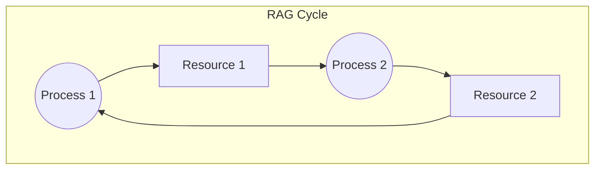

# Class Notes: Resource Dependency Analysis & Deadlock Detection
**Course:** CS-301 Operating Systems Lab  
**Module 5:** Deadlock Management & Resource Allocation  
**Topic:** Deadlock Conditions, Resource Allocation Graphs (RAG), and Cycle Detection  
**Date:** June 25, 2026  

---

## 1. Objective
To understand the four necessary conditions for deadlocks, analyze resource allocation and request dependencies using Resource Allocation Graphs (RAG), and implement cycle detection algorithms to identify system deadlocks.

---

## 2. The Four Coffman Conditions
A deadlock state occurs if and only if the following four conditions hold simultaneously in a system:

1.  **Mutual Exclusion:** At least one resource must be held in a non-shareable mode (only one process can use it at a time).
2.  **Hold and Wait:** A process must currently hold at least one resource and be waiting to acquire additional resources that are being held by other processes.
3.  **No Preemption:** Resources cannot be preempted; a resource can be released only voluntarily by the process holding it after that process has finished its task.
4.  **Circular Wait:** A closed chain of processes exists such that each process holds at least one resource needed by the next process in the chain. E.g., $P_0 \rightarrow P_1 \rightarrow P_2 \rightarrow P_0$.

---

## 3. Resource Allocation Graph (RAG)
A directed graph $G = (V, E)$ used to describe deadlock states.

*   **Vertices ($V$):** Divided into two sets:
    *   **Processes ($P$):** $P = \{P_1, P_2, \dots, P_n\}$ (represented as circles).
    *   **Resources ($R$):** $R = \{R_1, R_2, \dots, R_m\}$ (represented as rectangles).
*   **Edges ($E$):**
    *   **Request Edge:** Directed edge $P_i \rightarrow R_j$ (Process $P_i$ is waiting for resource $R_j$).
    *   **Assignment Edge:** Directed edge $R_j \rightarrow P_i$ (Resource $R_j$ is allocated to process $P_i$).

### RAG Deadlock Cycle Visualized:


### Graph Rules for Deadlocks:
*   If the graph contains **no cycles**, the system is definitely **not deadlocked**.
*   If the graph contains **a cycle**:
    *   If resources have **single instances**, then a deadlock exists.
    *   If resources have **multiple instances**, a cycle indicates a *potential* deadlock, but not a guaranteed one.

---

## 4. Deadlock Detection Algorithm (Multiple Instances)
For systems with multiple instances of each resource type, we use a detection algorithm similar to the safety algorithm of the Banker's Algorithm.

### Data Structures:
*   `Available`: Vector of length $m$ indicating available instances of each resource.
*   `Allocation`: An $n \times m$ matrix defining resources currently allocated to each process.
*   `Request`: An $n \times m$ matrix defining current requests of each process.

### Algorithm Steps:
1.  Initialize `Work` vector of size $m$ equal to `Available`.
    Initialize `Finish` vector of size $n$:
    *   If `Allocation[i] != 0`, set `Finish[i] = false`.
    *   Else, set `Finish[i] = true`.
2.  Find an index $i$ such that:
    *   `Finish[i] == false`
    *   `Request[i] <= Work`
    If no such $i$ exists, go to step 4.
3.  Reclaim resources:
    *   `Work = Work + Allocation[i]`
    *   `Finish[i] = true`
    Go back to step 2.
4.  If `Finish[i] == false` for any $i$, then the system is **deadlocked**, and process $P_i$ is deadlocked.

---

## 5. Python Code: Deadlock Detection
```python
import numpy as np

def detect_deadlock(allocation, request, available):
    n, m = allocation.shape
    work = np.copy(available)
    finish = np.zeros(n, dtype=bool)
    
    # Processes with zero allocation are marked finished
    for i in range(n):
        if np.all(allocation[i] == 0):
            finish[i] = True
            
    while True:
        found = False
        for i in range(n):
            if not finish[i] and np.all(request[i] <= work):
                work += allocation[i]
                finish[i] = True
                found = True
                print(f"Process P{i} executes and releases resources. Work: {work}")
                break
        if not found:
            break
            
    deadlocked = [i for i in range(n) if not finish[i]]
    return deadlocked

if __name__ == "__main__":
    # 3 processes, 3 resources
    alloc = np.array([
        [0, 1, 0],  # P0 holds R1
        [2, 0, 0],  # P1 holds R0
        [3, 0, 3]   # P2 holds R0, R2
    ])
    
    req = np.array([
        [0, 0, 0],
        [2, 0, 2],  # P1 requests R0, R2
        [0, 0, 0]
    ])
    
    avail = np.array([0, 0, 0])
    
    deadlocked_procs = detect_deadlock(alloc, req, avail)
    if deadlocked_procs:
        print(f"\nSystem is DEADLOCKED. Deadlocked processes: {deadlocked_procs}")
    else:
        print("\nSystem is not deadlocked. Clean execution.")
```
