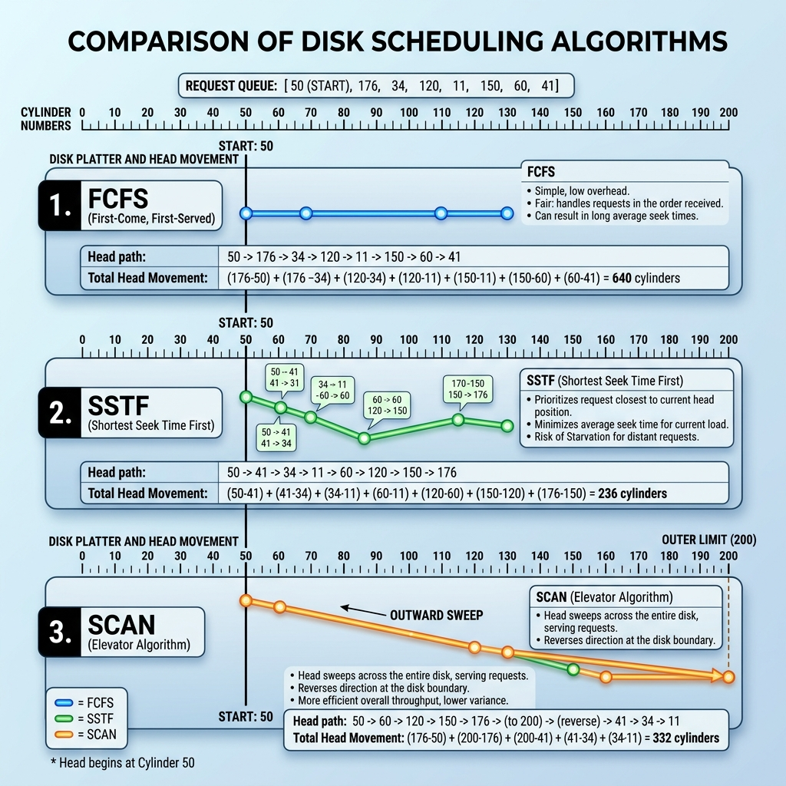

# Class Notes: Disk Access Optimization Strategies (Disk Scheduling)
**Course:** CS-301 Operating Systems Lab  
**Module 8:** Disk Scheduling & Storage Optimization  
**Topic:** Disk Scheduling Algorithms (FCFS, SSTF, SCAN, C-SCAN), Seek Time Minimization, and Performance Comparison  
**Date:** June 25, 2026  

---

## 1. Objective
To understand how secondary storage access is optimized, evaluate disk scheduling strategies by computing total head movements (seek time overheads) through a structured numerical problem, and compare their performance characteristics.

---

## 2. Core Concepts: Disk Scheduling
In a mechanical Hard Disk Drive (HDD), the read-write head must physically move to the correct cylinder (track) to access data.
*   **Seek Time:** The time taken for the disk arm to move the read-write head to the desired cylinder. This is the largest bottleneck in secondary storage performance.
*   **Rotational Latency:** The time taken for the desired sector to rotate under the read-write head.
*   **Disk Scheduling:** The process of ordering disk I/O requests to minimize total head movement, thereby reducing average seek time.

---

## 3. Disk Scheduling Algorithms
1.  **First-Come, First-Served (FCFS):**
    *   *Mechanism:* Processes requests sequentially in the order of their arrival.
    *   *Properties:* Fair, no starvation, but leads to wild head swings (high average seek time).
2.  **Shortest Seek Time First (SSTF):**
    *   *Mechanism:* Selects the request closest to the current head position.
    *   *Properties:* Minimizes seek time, but prone to **starvation** of requests located far from the current head position if new close requests keep arriving.
3.  **SCAN (Elevator Algorithm):**
    *   *Mechanism:* The disk arm moves in one direction, satisfying requests until it reaches the end cylinder, then reverses direction to satisfy remaining requests.
4.  **Circular SCAN (C-SCAN):**
    *   *Mechanism:* Head moves in one direction satisfying requests until it reaches the end, then immediately returns to the starting cylinder without satisfying any requests on the return trip, and starts again. Provides a more uniform waiting time.

---

## 4. Visual Analysis of Head Movements
The diagram below compares the head movement paths and total cylinder sweeps for FCFS, SSTF, and SCAN algorithms:



---

## 5. Practice Problem: Numerical Analysis
**Problem Statement:** A disk queue contains requests for the following cylinders:
$$\text{Queue} = [98,\ 183,\ 37,\ 122,\ 14,\ 124,\ 65,\ 67]$$
*   **Current Head Position:** Cylinder $53$
*   **Disk Range:** $0$ to $199$
*   *For SCAN/C-SCAN:* The head is moving towards higher-numbered cylinders (direction = outward / up).

Compute the total head movement (in cylinders) for FCFS, SSTF, SCAN, and C-SCAN.

---

### A. FCFS Scheduling
*Path:* $53 \rightarrow 98 \rightarrow 183 \rightarrow 37 \rightarrow 122 \rightarrow 14 \rightarrow 124 \rightarrow 65 \rightarrow 67$
*   $|98 - 53| = 45$
*   $|183 - 98| = 85$
*   $|37 - 183| = 146$
*   $|122 - 37| = 85$
*   $|14 - 122| = 108$
*   $|124 - 14| = 110$
*   $|65 - 124| = 59$
*   $|67 - 65| = 2$

*   **Total Head Movement (FCFS):** $45 + 85 + 146 + 85 + 108 + 110 + 59 + 2 = 640\text{ cylinders}$

---

### B. SSTF Scheduling
*Path:* $53 \rightarrow 65 \rightarrow 67 \rightarrow 98 \rightarrow 122 \rightarrow 124 \rightarrow 183 \rightarrow 37 \rightarrow 14$
1.  From $53$, closest is $65$ (diff 12).
2.  From $65$, closest is $67$ (diff 2).
3.  From $67$, closest is $98$ (diff 31).
4.  From $98$, closest is $122$ (diff 24).
5.  From $122$, closest is $124$ (diff 2).
6.  From $124$, closest is $183$ (diff 59).
7.  From $183$, closest is $37$ (diff 146).
8.  From $37$, closest is $14$ (diff 23).

*   **Total Head Movement (SSTF):** $12 + 2 + 31 + 24 + 2 + 59 + 146 + 23 = 299\text{ cylinders}$

---

### C. SCAN Scheduling (Moving towards 199)
*Path:* $53 \rightarrow 65 \rightarrow 67 \rightarrow 98 \rightarrow 122 \rightarrow 124 \rightarrow 183 \rightarrow 199\text{ (end)} \rightarrow 37 \rightarrow 14$
*   Note: Arm goes all the way to $199$ before reversing.
*   Movement outbound: $199 - 53 = 146\text{ cylinders}$
*   Movement inbound: $199 - 14 = 185\text{ cylinders}$

*   **Total Head Movement (SCAN):** $146 + 185 = 331\text{ cylinders}$

---

### D. C-SCAN Scheduling (Moving towards 199)
*Path:* $53 \rightarrow 65 \rightarrow 67 \rightarrow 98 \rightarrow 122 \rightarrow 124 \rightarrow 183 \rightarrow 199\text{ (end)} \rightarrow 0\text{ (reset)} \rightarrow 14 \rightarrow 37$
*   Movement outbound: $199 - 53 = 146\text{ cylinders}$
*   Reset to 0: $199 - 0 = 199\text{ cylinders}$ (often calculated as $0$ seek overhead depending on textbook, but standard is to include it as a return sweep). *Assuming return sweep is counted:*
*   Movement in second pass: $37 - 0 = 37\text{ cylinders}$

*   **Total Head Movement (C-SCAN):** $146 + 199 + 37 = 382\text{ cylinders}$  
    *(If return sweep is ignored as $0$ seek time: $146 + 37 = 183\text{ cylinders}$.)*

---

## 6. Python Code: Disk Scheduling Simulation
```python
def simulate_fcfs_disk(head, queue):
    current = head
    total_movement = 0
    path = [head]
    for req in queue:
        total_movement += abs(req - current)
        current = req
        path.append(req)
    return total_movement, path

def simulate_sstf_disk(head, queue):
    current = head
    total_movement = 0
    q = list(queue)
    path = [head]
    
    while q:
        # Find closest request
        closest = min(q, key=lambda x: abs(x - current))
        total_movement += abs(closest - current)
        current = closest
        q.remove(closest)
        path.append(closest)
        
    return total_movement, path

if __name__ == "__main__":
    queue = [98, 183, 37, 122, 14, 124, 65, 67]
    start_head = 53
    
    fcfs_movement, fcfs_path = simulate_fcfs_disk(start_head, queue)
    sstf_movement, sstf_path = simulate_sstf_disk(start_head, queue)
    
    print(f"FCFS Total Head Movement: {fcfs_movement} cylinders | Path: {fcfs_path}")
    print(f"SSTF Total Head Movement: {sstf_movement} cylinders | Path: {sstf_path}")
```
