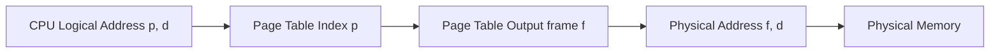

# Class Notes: Address Translation Mechanism (Paging & MMU)
**Course:** CS-301 Operating Systems Lab  
**Module 6:** Memory Management & Allocation Strategies  
**Topic:** Paging, Logical-to-Physical Address Mapping, and MMU Operations  
**Date:** June 25, 2026  

---

## 1. Objective
To understand the architecture of paging-based memory management, examine how logical addresses are translated into physical addresses by the Memory Management Unit (MMU), and solve practical translation calculations using a structured numerical.

---

## 2. Core Concepts: Paging
Paging is a memory management scheme that eliminates the need for contiguous allocation of physical memory.

*   **Logical Address Space (LAS):** Divided into fixed-size blocks called **Pages**.
*   **Physical Address Space (PAS):** Divided into fixed-size blocks of the same size called **Frames**.
*   **Page Table:** A kernel data structure allocated for each process. It maps page numbers of a process to the corresponding frame numbers in physical memory.

---

## 3. Address Structure and MMU Translation
The CPU generates a **Logical Address** (virtual address) containing two parts:
$$\text{Logical Address} = \langle p,\ d \rangle$$
*   **Page Number ($p$):** Used as an index into the page table.
*   **Page Offset ($d$):** Combined with the base address of the physical frame to define the physical address.

The **Memory Management Unit (MMU)** translates this to a **Physical Address**:
$$\text{Physical Address} = \langle f,\ d \rangle$$
*   **Frame Number ($f$):** Retrieved from the page table using index $p$.
*   **Offset ($d$):** Remains identical (copied directly from logical address).

### Address Translation Flow:


---

## 4. Practice Problem: Numerical Analysis
**Problem Statement:** Consider a system with:
*   Logical Address Space (LAS) = $16\text{ KB}$ ($2^{14}$ bytes)
*   Physical Memory Size (PAS) = $32\text{ KB}$ ($2^{15}$ bytes)
*   Page/Frame Size = $2\text{ KB}$ ($2^{11}$ bytes)

The Page Table is defined as:
*   Page $0 \rightarrow$ Frame $5$
*   Page $1 \rightarrow$ Frame $3$
*   Page $2 \rightarrow$ Frame $7$
*   Page $3 \rightarrow$ Frame $2$

---

### A. Preliminary Computations:
1.  **Number of Pages:**
    $$\text{Number of Pages} = \frac{\text{LAS}}{\text{Page Size}} = \frac{16\text{ KB}}{2\text{ KB}} = 8\text{ pages}$$
    *Requires $\log_2(8) = 3$ bits for Page Number ($p$).*
2.  **Number of Frames:**
    $$\text{Number of Frames} = \frac{\text{PAS}}{\text{Page Size}} = \frac{32\text{ KB}}{2\text{ KB}} = 16\text{ frames}$$
    *Requires $\log_2(16) = 4$ bits for Frame Number ($f$).*
3.  **Offset Size:**
    $$\text{Page Size} = 2\text{ KB} = 2048\text{ bytes} \implies 11\text{ bits for Offset ($d$).}$$

---

### B. Address Translation for Logical Address $3000$ (Decimal):
1.  **Extract Page Number ($p$) and Offset ($d$):**
    $$p = \lfloor \frac{\text{Logical Address}}{\text{Page Size}} \rfloor = \lfloor \frac{3000}{2048} \rfloor = 1$$
    $$d = \text{Logical Address} \pmod{\text{Page Size}} = 3000 \pmod{2048} = 952$$
    *Thus, the logical address maps to Page 1, Offset 952.*
2.  **Retrieve Frame Number ($f$) from Page Table:**
    *   Looking up Page $1$ in the Page Table yields Frame $3$.
3.  **Compute Physical Address:**
    $$\text{Physical Address} = (\text{Frame Number} \times \text{Page Size}) + \text{Offset}$$
    $$\text{Physical Address} = (3 \times 2048) + 952 = 6144 + 952 = 7096\text{ (Decimal)}$$

---

## 5. Translation Lookaside Buffer (TLB)
Because page tables are stored in main memory, accessing a byte of data requires two memory accesses (one for page table lookup, one for actual data). To solve this bottleneck, the MMU uses a hardware cache called the **Translation Lookaside Buffer (TLB)**.
*   **TLB Hit:** Page number is found in the TLB cache. Address translation completes in $1$ clock cycle.
*   **TLB Miss:** Page number is not in the TLB. The MMU looks up the page table in memory, translates the address, and inserts the mapping into the TLB for future access.

---

## 6. Python Code: Paging Simulation
```python
def translate_paging(logical_address, page_size, page_table):
    p = logical_address // page_size
    d = logical_address % page_size
    
    print(f"Logical Address: {logical_address}")
    print(f"-> Page Number (p): {p}")
    print(f"-> Offset (d): {d}")
    
    if p in page_table:
        f = page_table[p]
        physical_address = (f * page_size) + d
        print(f"-> Frame Number (f): {f}")
        print(f"-> Physical Address: {physical_address}")
        return physical_address
    else:
        print("-> Page Fault / Invalid Page Access!")
        return -1

if __name__ == "__main__":
    # Page Table: Page -> Frame
    page_table = {0: 5, 1: 3, 2: 7, 3: 2}
    page_size = 2048  # 2 KB
    
    translate_paging(3000, page_size, page_table)
```
