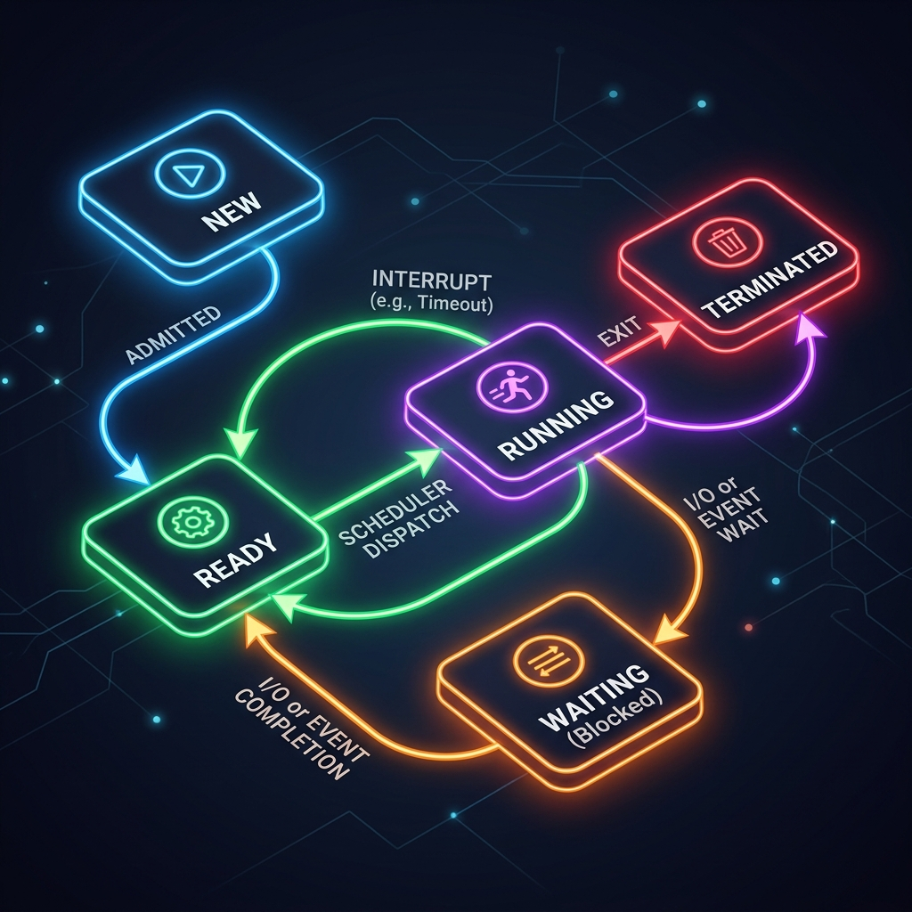
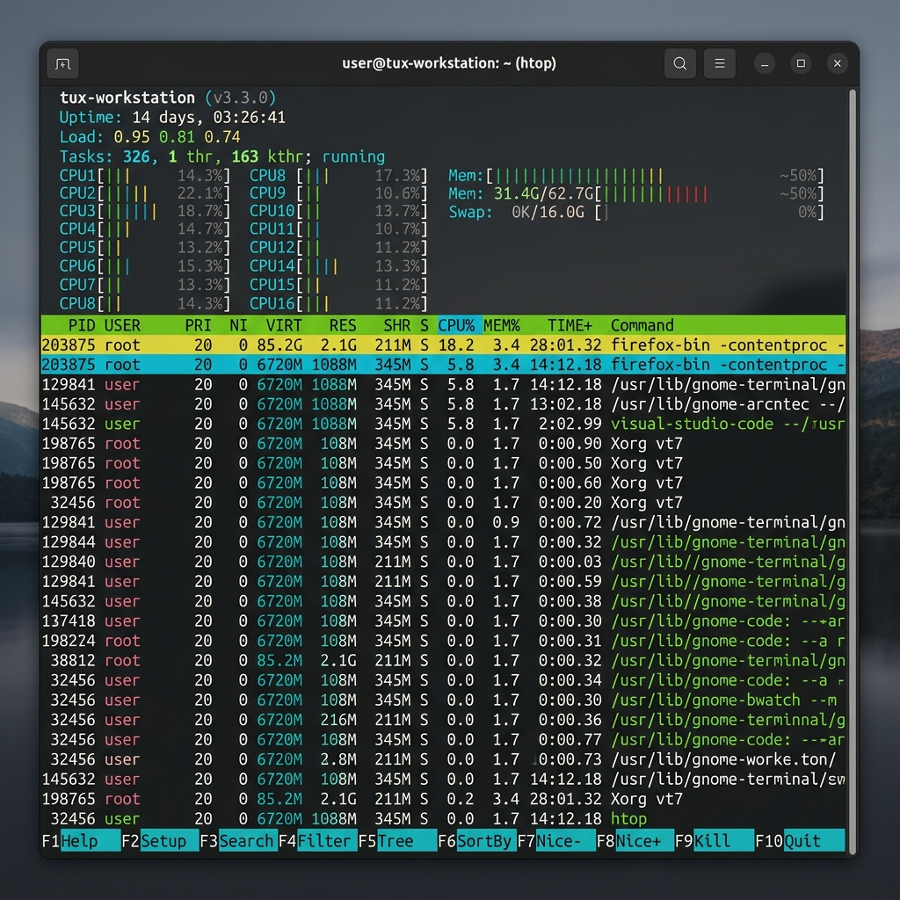

# Class Notes: Linux Process Monitoring & State Observations
**Course:** CS-301 Operating Systems Lab  
**Module 1:** Process Management & Execution Models  
**Topic:** Process Lifecycle Analysis & Program Execution Workflow  
**Date:** June 11, 2026  

---

## 1. Objective
To observe, monitor, and analyze running processes in a Linux environment using command-line utilities (`ps`, `top`, `htop`), mapping practical findings to the theoretical 5-state process lifecycle model.

---

## 2. Core Concepts: Program vs. Process
*   **Program (Static):** A passive entity, a file containing a list of instructions stored on disk (e.g., an executable binary like `/bin/ls` or a script).
*   **Process (Dynamic):** An active entity, a program in execution. It includes:
    *   **Program Counter (PC):** Points to the next instruction to execute.
    *   **Stack:** Contains temporary data (function parameters, return addresses, local variables).
    *   **Data Section:** Contains global and static variables.
    *   **Heap:** Dynamically allocated memory during runtime.
    *   **Process Control Block (PCB):** The kernel data structure representing the process (contains PID, state, registers, memory limits, open files list).

---

## 3. The 5-State Process Model vs. Linux Process States
In theory, a process transitions through five fundamental states. In Linux, these map to specific scheduler flags:

| Theoretical State | Linux Representation / Flag | Description |
| :--- | :--- | :--- |
| **New** | Created state | The process is being created but is not yet loaded into memory. |
| **Ready** | `TASK_RUNNING` (R) | The process is loaded in memory and waiting in the run-queue to be assigned to a CPU. |
| **Running** | `TASK_RUNNING` (R) | The CPU is currently executing the process instructions. |
| **Waiting / Blocked** | `TASK_INTERRUPTIBLE` (S) / `TASK_UNINTERRUPTIBLE` (D) | The process is waiting for an event or resource (like disk I/O, network socket, or a sleep signal). |
| **Terminated** | `EXIT_ZOMBIE` (Z) / `EXIT_DEAD` (X) | The process has finished execution but its entry remains in the process table to report status to the parent. |

### Process Lifecycle State Transitions
The workflow below illustrates how processes move between states based on scheduler actions, system interrupts, and resource availability:



---

## 4. Hands-On Utilities for Process Monitoring

### A. The `ps` (Process Status) Utility
The `ps` command provides a static snapshot of current active processes.
*   **Common Command Combinations:**
    *   `ps aux`: Displays all running processes for all users, including those without a controlling terminal.
    *   `ps -ef`: Displays all processes using standard System V syntax with parent process IDs (PPID).
*   **Key Field Explanations:**
    *   `PID`: Process ID (unique identifier).
    *   `PPID`: Parent Process ID.
    *   `STAT`: Current process state (e.g., `Ss` where `S` is sleeping, `s` is session leader).
    *   `%CPU` & `%MEM`: Percentage of CPU and RAM consumed.
    *   `COMMAND`: The command/binary that spawned the process.

#### Sample Snapshot of `ps aux` Output:
```bash
USER         PID %CPU %MEM    VSZ   RSS TTY      STAT START   TIME COMMAND
root           1  0.0  0.1  24604 14284 ?        Ss   Jun09   0:11 /sbin/init splash
root           2  0.0  0.0      0     0 ?        S    Jun09   0:00 [kthreadd]
vixx      498821  8.3  0.0  16040  6476 pts/1    R+   13:53   0:00 ps aux
```

### B. The `top` (Table of Processes) Utility
The `top` command provides a dynamic, real-time view of system tasks, refreshed every few seconds.
*   **Header Insights:**
    *   **Load Average:** Average system load over the last 1, 5, and 15 minutes.
    *   **Tasks:** Total counts of tasks (running, sleeping, stopped, zombie).
    *   **%Cpu(s):** Breakdown of CPU time spent on user processes (`us`), system/kernel (`sy`), idle (`id`), and waiting for disk I/O (`wa`).
*   **Key Interaction Keys:**
    *   `k`: Kill a process (prompts for PID and signal).
    *   `q`: Quit the utility.
    *   `M`: Sort by memory usage.
    *   `P`: Sort by CPU usage.

### C. The `htop` Utility
`htop` is an interactive, color-coded, user-friendly process viewer that extends `top`.
*   **Key Features:**
    *   Horizontal and vertical scrolling of processes.
    *   Visual bar indicators for multi-core CPU, Memory, and Swap.
    *   Process Tree View (`F5`) to clearly visualize child-parent relationships.
    *   Easy search (`F3`) and filter (`F4`) operations.

Here is a visual capture of the active terminal running `htop` to audit active processes:



---

## 5. Summary and Key Takeaways
1.  **State Identification:** Most processes in a healthy Linux system remain in the Sleeping (`S` or `TASK_INTERRUPTIBLE`) state because they execute rapidly and then wait for user input or hardware events.
2.  **Resource Auditing:** Regularly checking Load Average helps identify CPU bottlenecks before they freeze the operating system.
3.  **Parent-Child Tracking:** The `PPID` is crucial for debugging application leaks, helping developers trace which parent process is creating rogue child threads or zombie sub-processes.
