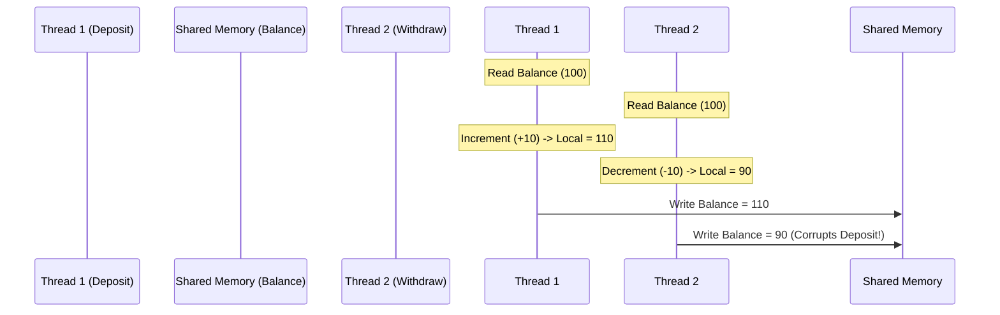

# Class Notes: Concurrency Issues & Race Condition Detection
**Course:** CS-301 Operating Systems Lab  
**Module 4:** Process Synchronization & Concurrency  
**Topic:** Race Conditions, Critical Section Problem, and Software/Hardware Solutions  
**Date:** June 25, 2026  

---

## 1. Objective
To analyze concurrency issues in multi-threaded programs, observe race conditions in shared mutable memory, understand the properties of a valid solution to the Critical Section Problem, and evaluate software (Peterson's) and hardware (TestAndSet/CompareAndSwap) synchronization mechanisms.

---

## 2. The Critical Section Problem
A **Critical Section (CS)** is a segment of code that accesses shared mutable resources (variables, files, sockets) where concurrent updates can lead to inconsistent state.

The Critical Section Problem requires designing a protocol that processes must use to coordinate their entry to the CS. Any valid solution must satisfy three requirements:

1.  **Mutual Exclusion:** If process $P_i$ is executing in its critical section, then no other processes can execute in their critical sections.
2.  **Progress:** If no process is executing in its critical section and some processes wish to enter, only those processes that are not executing in their remainder sections can participate in deciding which process will enter next, and this selection cannot be postponed indefinitely.
3.  **Bounded Waiting:** There must be a limit on the number of times that other processes are allowed to enter their critical sections after a process has made a request to enter and before that request is granted (prevents starvation).

```
Entry Section -> Critical Section -> Exit Section -> Remainder Section
```

---

## 3. Software Solution: Peterson's Algorithm
Peterson's solution is a classic software-based solution to the critical section problem for **two processes** (say $P_0$ and $P_1$).

### Shared Variables:
```c
bool flag[2]; // flag[i] = true indicates Pi is ready to enter CS
int turn;     // Indicates whose turn it is to enter CS
```

### Algorithm Structure (for Process $P_i$ where $j = 1 - i$):
```c
while (true) {
    flag[i] = true;             // State interest
    turn = j;                   // Give turn to the other process
    while (flag[j] && turn == j) {
        // Busy wait (do nothing)
    }
    
    // CRITICAL SECTION
    
    flag[i] = false;            // Reset interest
    
    // REMAINDER SECTION
}
```

### Proof of Correctness:
1.  **Mutual Exclusion:** Since `turn` can only be $0$ or $1$, one of the processes must break the `while` loop condition while the other remains stuck.
2.  **Progress:** A process $P_i$ is prevented from entering only if it is blocked by `flag[j] && turn == j`. If $P_j$ does not want to enter, `flag[j]` is false, and $P_i$ enters immediately.
3.  **Bounded Waiting:** If both want to enter, the assignations of `turn` ensure that they alternate entry, guaranteeing no process waits longer than one turn.

*Note:* Peterson's solution is not guaranteed to work on modern multi-core CPUs due to **instruction reordering** by compilers and processors.

---

## 4. Hardware-Assisted Synchronization
Modern hardware provides atomic instructions to solve the critical section problem. **Atomic** means the instruction executes as a single indivisible unit (cannot be interrupted).

### A. TestAndSet Instruction
This instruction reads and modifies a memory location atomically:
```c
bool TestAndSet(bool *target) {
    bool rv = *target;
    *target = true; // Set to true
    return rv;      // Return original value
}
```
#### Mutual Exclusion Implementation:
```c
bool lock = false;

while (true) {
    while (TestAndSet(&lock)) {
        // Busy wait
    }
    
    // CRITICAL SECTION
    
    lock = false;
    
    // REMAINDER SECTION
}
```

### B. CompareAndSwap (CAS) Instruction
CAS compares the content of a memory location to a given value and, if they are equal, modifies that memory location to a new value:
```c
int CompareAndSwap(int *value, int expected, int new_value) {
    int temp = *value;
    if (*value == expected) {
        *value = new_value;
    }
    return temp;
}
```

---

## 5. Thread Interleaving and Race Condition Demonstration (Python)
The script below demonstrates a race condition where thread scheduling interleaves and corrupts a shared bank balance.

```python
import threading
import time

balance = 100  # Shared Global Variable

def deposit(amount):
    global balance
    for _ in range(100000):
        # Read balance
        local_balance = balance
        # Simulate work / context switch
        local_balance += amount
        # Write back
        balance = local_balance

def withdraw(amount):
    global balance
    for _ in range(100000):
        local_balance = balance
        local_balance -= amount
        balance = local_balance

if __name__ == "__main__":
    t1 = threading.Thread(target=deposit, args=(10,))
    t2 = threading.Thread(target=withdraw, args=(10,))
    
    t1.start()
    t2.start()
    
    t1.join()
    t2.join()
    
    print(f"Final Account Balance: {balance} (Expected: 100)")
```

### Explanation of Thread Interleaving:

The final state is $90$ instead of $100$.
