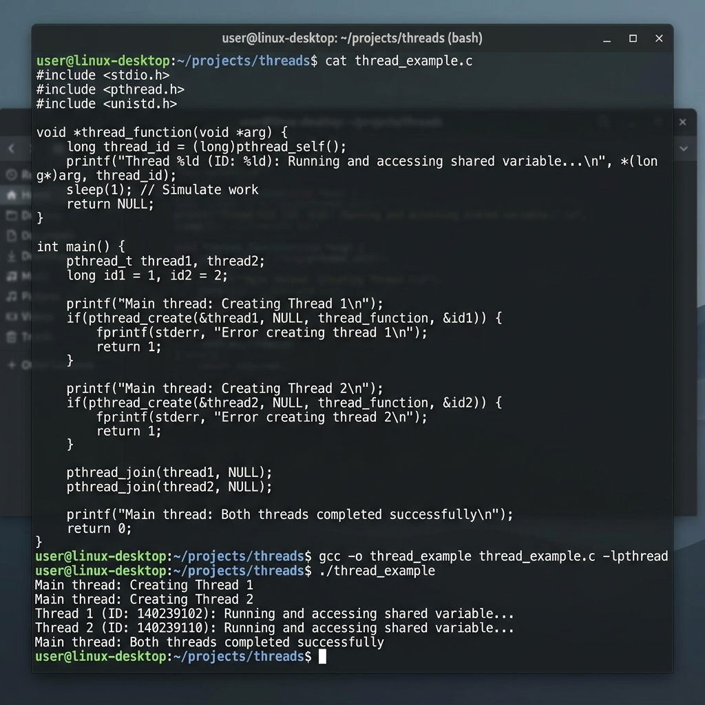

# Class Notes: Process vs. Thread Execution & Structural Comparison
**Course:** CS-301 Operating Systems Lab  
**Module 2:** Process vs. Thread Execution in Modern Systems  
**Topic:** Process vs. Thread Architecture, Overhead, and Code Demonstrations  
**Date:** June 11, 2026  

---

## 1. Objective
To examine the structural differences between processes and threads, compare their resource allocations and execution overheads, and write code examples (C with POSIX fork and threads) to demonstrate concurrent execution.

---

## 2. Structural and Architectural Differences
An operating system manages execution through two primary abstractions:

*   **Process:** An independent unit of resource allocation and execution. Each process runs in its own protected virtual address space.
*   **Thread (Lightweight Process - LWP):** The smallest unit of execution scheduling within a process. A thread exists entirely inside the context of a process.

### Resource Allocation Comparison Diagram:
```
+-------------------------------------------------------+
|                       PROCESS                         |
|  +--------------------+----------------------------+  |
|  | Code Segment       | Data Segment (Globals)     |  |
|  +--------------------+----------------------------+  |
|  | Heap (Dynamic Mem) | File Descriptors / Sockets |  |
|  +--------------------+----------------------------+  |
|                                                       |
|  +------------------+  +------------------+           |
|  |    THREAD 1      |  |    THREAD 2      |           |
|  |  - PC            |  |  - PC            |           |
|  |  - Registers     |  |  - Registers     |           |
|  |  - Private Stack |  |  - Private Stack |           |
|  +------------------+  +------------------+           |
+-------------------------------------------------------+
```

---

## 3. Practical Implementations in C

### A. Process Creation via `fork()`
In Linux, processes are cloned using `fork()`. The child process gets a separate copy of the parent's memory address space (optimized via Copy-on-Write).

```c
#include <stdio.h>
#include <unistd.h>
#include <sys/types.h>
#include <sys/wait.h>

int shared_var = 100;

int main() {
    pid_t pid = fork();

    if (pid < 0) {
        printf("Fork failed\n");
        return 1;
    }

    if (pid == 0) {
        // Child Process
        shared_var += 50; // Modify child's copy
        printf("[CHILD] Child modified shared_var to %d\n", shared_var);
    } else {
        // Parent Process
        wait(NULL); // Wait for child to exit
        printf("[PARENT] Parent observes shared_var as %d\n", shared_var);
    }
    return 0;
}
```
**Observation:** The parent process output remains `100` because the child modified its own isolated copy of `shared_var`.

---

### B. Thread Creation via `pthread_create()`
Threads share the parent process's memory space, which allows direct sharing of global variables.

```c
#include <stdio.h>
#include <pthread.h>
#include <unistd.h>

int shared_var = 100;

void* thread_func(void* arg) {
    long id = (long)arg;
    shared_var += 50; // Directly modify process memory
    printf("[THREAD %ld] Modified shared_var to %d\n", id, shared_var);
    return NULL;
}

int main() {
    pthread_t tid1;
    pthread_create(&tid1, NULL, thread_func, (void*)1);
    pthread_join(tid1, NULL); // Wait for thread to finish
    
    printf("[MAIN] Main thread observes shared_var as %d\n", shared_var);
    return 0;
}
```
**Observation:** The main thread observes the updated value `150` because threads share the same global data space.

#### Visual Verification of Thread Execution:
Below is the execution output screenshot proving successful compilation and execution of a POSIX multi-threaded application in Linux:



---

## 4. Overhead Analysis

### A. Creation Overhead
*   **Process Creation:** High overhead. The OS kernel must allocate memory descriptors, set up virtual memory page tables, clone file descriptor tables, and assign security descriptors.
*   **Thread Creation:** Low overhead. The OS creates a thread structure, allocates a small stack area (typically 8MB max default, but customizable), registers the thread with the CPU scheduler, and initializes its CPU registers.

### B. Context Switching Overhead
*   **Process Context Switch:** Expensive. The CPU must:
    1. Save registers of the current process.
    2. Switch the active Page Directory Pointer Register (e.g., CR3 in x86), which invalidates the **Translation Lookaside Buffer (TLB)** cache. This results in costly memory cache misses.
    3. Load registers of the new process.
*   **Thread Context Switch (Same Process):** Fast. The virtual memory address space remains identical, so:
    1. No page table switch is needed.
    2. The TLB cache is preserved.
    3. The CPU only swaps register sets and stack pointers.
