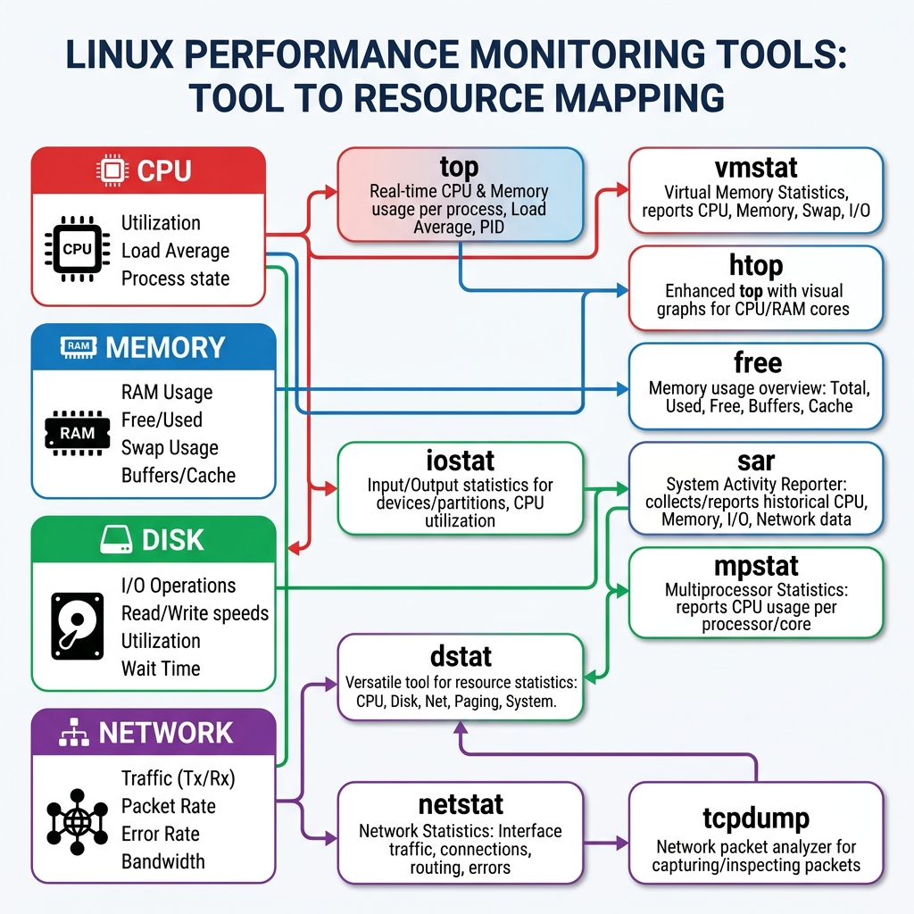

# Class Notes: Linux-Based System Performance Monitoring & Bottleneck Analysis
**Course:** CS-301 Operating Systems Lab  
**Module 9:** System Performance Monitoring & Analysis  
**Topic:** System Auditing, Performance Utilities (vmstat, iostat, sar), and Bottleneck Diagnoses  
**Date:** June 25, 2026  

---

## 1. Objective
To monitor system-level resource utilization in a Linux environment, interpret performance metrics from kernel utilities (`vmstat`, `iostat`, `sar`, `free`), diagnose system bottlenecks (CPU, Memory, disk I/O, and Network), and write a shell script to automate health auditing.

---

## 2. Tool-to-Resource Mapping
The diagram below maps various Linux command-line utilities to the specific system hardware and execution metrics they monitor:



---

## 3. Core System Utilities & Sample Command Outputs

### A. Memory Monitoring: `free`
Displays the total amount of free and used physical memory (RAM) and swap space.
```bash
$ free -m
              total        used        free      shared  buff/cache   available
Mem:          15842        4210        8120         320        3512       11312
Swap:          2048           0        2048
```
*   **buff/cache:** Memory used by the kernel for disk caching and buffers. This memory can be reclaimed instantly by user processes when needed.
*   **available:** The estimated RAM available to start new applications without swapping.

---

### B. Virtual Memory Statistics: `vmstat`
Provides virtual memory statistics including active processes, memory usage, paging/swapping, block I/O, and CPU activity.
```bash
$ vmstat 1 3
procs -----------memory---------- ---swap-- -----io---- -system-- ------cpu-----
 r  b   swpd   free   buff  cache   si   so    bi    bo   in   cs us sy id wa st
 2  0      0 8314880 359628 3596280    0    0    12    45  412  850  8  4 87  1  0
```
*   **r (run-queue):** The number of runnable processes waiting for CPU time. If `r` is consistently greater than the number of CPU cores, it indicates a **CPU bottleneck**.
*   **b (blocked):** Number of processes in uninterruptible sleep (typically waiting for disk I/O). High values indicate an **I/O bottleneck**.
*   **si / so (swap-in / swap-out):** Amount of memory swapped from/to disk per second. Values $>0$ indicate the system is running out of physical RAM.

---

### C. I/O Auditing: `iostat`
Reports Central Processing Unit (CPU) statistics and input/output statistics for devices.
```bash
$ iostat -xz 1 1
Device          r/s     w/s     rkB/s     wkB/s  await  %util
sda            0.12    4.50     12.00     90.00   8.50   1.20
```
*   **await:** The average time (in milliseconds) for I/O requests issued to the device to be served. Values $> 20\text{ ms}$ indicate overloaded disk queues.
*   **%util:** Percentage of CPU time during which I/O requests were issued to the device (bandwidth utilization). Values approaching $100\%$ represent disk saturation.

---

## 4. Performance Bottleneck Identification Summary

| Symptom | Resource Bottleneck | Diagnostic Tool & Field | Action Required |
| :--- | :--- | :--- | :--- |
| Run-queue ($r$) consistently high, low idle CPU ($id$). | **CPU Saturation** | `vmstat` (`r`), `top` (`%Cpu(s): us, sy`) | Scale CPU cores, optimize application algorithms. |
| High swap-out rate ($so > 0$), low free memory. | **RAM Exhaustion** | `vmstat` (`so`, `si`), `free` (`free`, `available`) | Upgrade physical RAM, resolve memory leaks. |
| High block queue ($b$), high wait CPU ($wa > 15\%$), high disk await. | **Disk I/O Bottleneck** | `vmstat` (`b`, `wa`), `iostat` (`await`, `%util`) | Upgrade to SSD, implement application caching, configure RAID. |
| Dropped packets, high error counts. | **Network Saturation** | `sar -n DEV`, `netstat -s` | Increase link bandwidth, balance traffic. |

---

## 5. Bash Script: Automated System Performance Auditing
The following script monitors the system and logs alerts if utilization metrics cross predefined thresholds.

```bash
#!/bin/bash
# System Audit Script

# Configuration thresholds
CPU_THRESHOLD=80
MEM_THRESHOLD=90
DISK_THRESHOLD=85
LOG_FILE="/home/vixx/Documents/college/g4/OS/SWC_G4_OS_23BCS11598/system-performance-monitoring/system_audit.log"

echo "=== System Audit Commenced: $(date) ===" >> "$LOG_FILE"

# 1. CPU Utilization Check
CPU_IDLE=$(vmstat 1 2 | tail -1 | awk '{print $15}')
CPU_USAGE=$((100 - CPU_IDLE))
if [ "$CPU_USAGE" -gt "$CPU_THRESHOLD" ]; then
    echo "[ALERT] CPU usage is critically high: ${CPU_USAGE}%" >> "$LOG_FILE"
else
    echo "[OK] CPU Usage: ${CPU_USAGE}%" >> "$LOG_FILE"
fi

# 2. Memory Utilization Check
MEM_TOTAL=$(free -m | grep Mem | awk '{print $2}')
MEM_AVAILABLE=$(free -m | grep Mem | awk '{print $7}')
MEM_USAGE=$((100 * (MEM_TOTAL - MEM_AVAILABLE) / MEM_TOTAL))
if [ "$MEM_USAGE" -gt "$MEM_THRESHOLD" ]; then
    echo "[ALERT] Memory usage is critically high: ${MEM_USAGE}%" >> "$LOG_FILE"
else
    echo "[OK] Memory Usage: ${MEM_USAGE}%" >> "$LOG_FILE"
fi

# 3. Disk Space Check (Root partition)
DISK_USAGE=$(df -h / | tail -1 | awk '{print $5}' | sed 's/%//')
if [ "$DISK_USAGE" -gt "$DISK_THRESHOLD" ]; then
    echo "[ALERT] Disk space is critically low: ${DISK_USAGE}% used" >> "$LOG_FILE"
else
    echo "[OK] Disk Space: ${DISK_USAGE}% used" >> "$LOG_FILE"
fi

echo "=== System Audit Complete: $(date) ===" >> "$LOG_FILE"
echo "" >> "$LOG_FILE"
```
