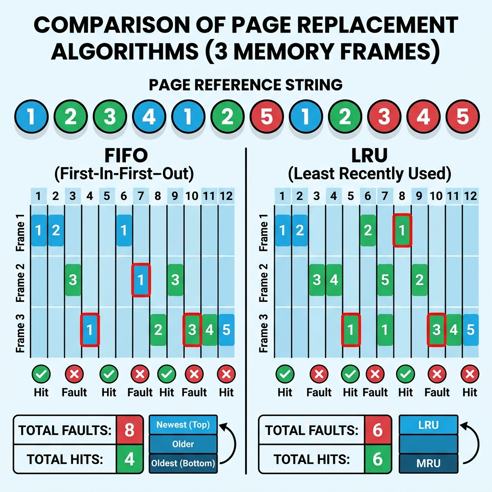

# Class Notes: Memory Optimization via Page Replacement Algorithms
**Course:** CS-301 Operating Systems Lab  
**Module 7:** Virtual Memory & Page Replacement  
**Topic:** Page Replacement Algorithms (FIFO, LRU, Optimal), Belady's Anomaly, and Locality Analysis  
**Date:** June 25, 2026  

---

## 1. Objective
To analyze virtual memory management optimization via page replacement strategies, calculate page faults and hit ratios for First-In-First-Out (FIFO), Least Recently Used (LRU), and Optimal page replacement algorithms, and evaluate Belady's Anomaly.

---

## 2. Paging and Page Faults
When a process requests a page that is not currently mapped into physical memory (RAM), a hardware interrupt occurs: a **Page Fault**.
1.  The OS intercepts the page fault trap.
2.  It locates the desired page on logical disk storage (swap/paging file).
3.  It finds a free frame in physical memory.
4.  **Page Replacement:** If no physical frames are free, the OS must select an active page in memory to be swapped out (replaced) to make room.
5.  The page is read into the allocated frame, page tables are updated, and the instruction is restarted.

---

## 3. Page Replacement Algorithms
The efficiency of virtual memory relies on minimizing page faults by choosing the best victim page for replacement.

1.  **First-In-First-Out (FIFO):**
    *   *Mechanism:* Replaces the oldest page (the one loaded into memory first).
    *   *Implementation:* Uses a FIFO queue to track pages.
    *   *Characteristic:* Prone to **Belady's Anomaly**.
2.  **Least Recently Used (LRU):**
    *   *Mechanism:* Replaces the page that has not been accessed for the longest duration of time.
    *   *Theory:* Based on the **Locality of Reference** (pages used recently are highly likely to be used again soon).
3.  **Optimal Page Replacement (OPT / MIN):**
    *   *Mechanism:* Replaces the page that will not be used for the longest period in the future.
    *   *Properties:* Provides the lowest possible page-fault rate. Unimplementable in practice because it requires future knowledge of execution. Used as a benchmark.

---

## 4. Visual Comparison
The diagram below illustrates how FIFO and LRU evaluate page references and update frame allocation, including a comparison of hits and page faults:



---

## 5. Practice Problem: Numerical Analysis
**Problem Statement:** A process references the following page string:
$$7,\ 0,\ 1,\ 2,\ 0,\ 3,\ 0,\ 4,\ 2,\ 3,\ 0,\ 3,\ 2$$
Using **3 physical frames**, compute the number of page faults for FIFO, LRU, and Optimal algorithms (assuming frames are initially empty).

---

### A. FIFO Page Replacement Tracing
*   **7** $\rightarrow$ [7, -, -] (Fault 1)
*   **0** $\rightarrow$ [7, 0, -] (Fault 2)
*   **1** $\rightarrow$ [7, 0, 1] (Fault 3)
*   **2** $\rightarrow$ [2, 0, 1] (Fault 4 - 7 is replaced since it was oldest)
*   **0** $\rightarrow$ [2, 0, 1] (Hit)
*   **3** $\rightarrow$ [2, 3, 1] (Fault 5 - 0 is replaced)
*   **0** $\rightarrow$ [2, 3, 0] (Fault 6 - 1 is replaced)
*   **4** $\rightarrow$ [4, 3, 0] (Fault 7 - 2 is replaced)
*   **2** $\rightarrow$ [4, 2, 0] (Fault 8 - 3 is replaced)
*   **3** $\rightarrow$ [4, 2, 3] (Fault 9 - 0 is replaced)
*   **0** $\rightarrow$ [0, 2, 3] (Fault 10 - 4 is replaced)
*   **3** $\rightarrow$ [0, 2, 3] (Hit)
*   **2** $\rightarrow$ [0, 2, 3] (Hit)

*   **Total Page Faults (FIFO):** $10$
*   **Hit Ratio:** $\frac{3}{13} \approx 23.08\%$

---

### B. LRU Page Replacement Tracing
*   **7** $\rightarrow$ [7, -, -] (Fault 1)
*   **0** $\rightarrow$ [7, 0, -] (Fault 2)
*   **1** $\rightarrow$ [7, 0, 1] (Fault 3)
*   **2** $\rightarrow$ [2, 0, 1] (Fault 4 - 7 was least recently used)
*   **0** $\rightarrow$ [2, 0, 1] (Hit - Recency order: 0, 2, 1)
*   **3** $\rightarrow$ [2, 0, 3] (Fault 5 - 1 was least recently used)
*   **0** $\rightarrow$ [2, 0, 3] (Hit - Recency order: 0, 3, 2)
*   **4** $\rightarrow$ [4, 0, 3] (Fault 6 - 2 was least recently used)
*   **2** $\rightarrow$ [4, 0, 2] (Fault 7 - 3 was least recently used)
*   **3** $\rightarrow$ [4, 3, 2] (Fault 8 - 0 was least recently used)
*   **0** $\rightarrow$ [0, 3, 2] (Fault 9 - 4 was least recently used)
*   **3** $\rightarrow$ [0, 3, 2] (Hit)
*   **2** $\rightarrow$ [0, 3, 2] (Hit)

*   **Total Page Faults (LRU):** $9$
*   **Hit Ratio:** $\frac{4}{13} \approx 30.77\%$

---

### C. Optimal Page Replacement Tracing
*   **7** $\rightarrow$ [7, -, -] (Fault 1)
*   **0** $\rightarrow$ [7, 0, -] (Fault 2)
*   **1** $\rightarrow$ [7, 0, 1] (Fault 3)
*   **2** $\rightarrow$ [2, 0, 1] (Fault 4 - 7 is replaced, as it is never used again)
*   **0** $\rightarrow$ [2, 0, 1] (Hit)
*   **3** $\rightarrow$ [2, 0, 3] (Fault 5 - 1 is replaced, as it is never used again)
*   **0** $\rightarrow$ [2, 0, 3] (Hit)
*   **4** $\rightarrow$ [2, 4, 3] (Fault 6 - 0 is replaced, as its next reference is furthest compared to 2 and 3)
*   **2** $\rightarrow$ [2, 4, 3] (Hit)
*   **3** $\rightarrow$ [2, 4, 3] (Hit)
*   **0** $\rightarrow$ [2, 0, 3] (Fault 7 - 4 is replaced)
*   **3** $\rightarrow$ [2, 0, 3] (Hit)
*   **2** $\rightarrow$ [2, 0, 3] (Hit)

*   **Total Page Faults (Optimal):** $7$
*   **Hit Ratio:** $\frac{6}{13} \approx 46.15\%$

---

## 6. Belady's Anomaly
**Belady's Anomaly** is the phenomenon where increasing the number of physical frames allocated to a process results in an *increase* in page faults.
*   **Occurrence:** Can happen in FIFO page replacement.
*   **Non-Occurrence:** Cannot happen in stack-based page replacement algorithms (such as LRU and Optimal) because the set of pages in memory for $N$ frames is always a subset of the pages in memory for $N+1$ frames.

### Classic Demonstration Sequence:
Reference string: $1, 2, 3, 4, 1, 2, 5, 1, 2, 3, 4, 5$
*   **With 3 frames:** 9 page faults.
*   **With 4 frames:** 10 page faults (Anomalous increase!).

---

## 7. Python Code: Page Replacement Simulation
```python
def simulate_fifo(pages, frame_count):
    frames = []
    faults = 0
    for page in pages:
        if page not in frames:
            if len(frames) < frame_count:
                frames.append(page)
            else:
                frames.pop(0)  # Remove first-in page
                frames.append(page)
            faults += 1
    return faults

def simulate_lru(pages, frame_count):
    frames = []
    faults = 0
    # Track order of usage
    usage = []
    for page in pages:
        if page not in frames:
            if len(frames) < frame_count:
                frames.append(page)
            else:
                lru_page = usage.pop(0)
                frames.remove(lru_page)
                frames.append(page)
            faults += 1
        else:
            usage.remove(page)
        usage.append(page)
    return faults

if __name__ == "__main__":
    ref_string = [7, 0, 1, 2, 0, 3, 0, 4, 2, 3, 0, 3, 2]
    print("FIFO Page Faults:", simulate_fifo(ref_string, 3))
    print("LRU Page Faults :", simulate_lru(ref_string, 3))
```
